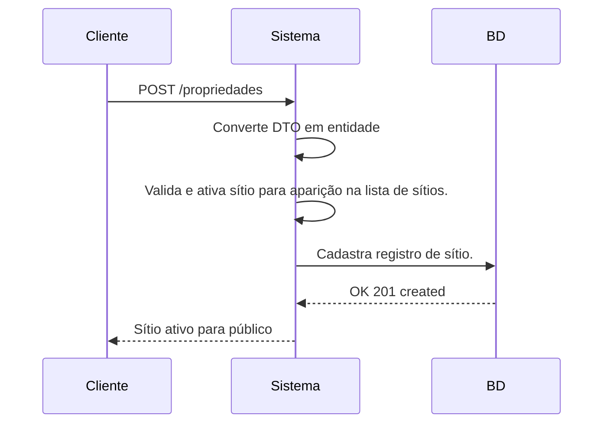

# angular7
Novidades do Angular 7

### Bundle Budgets
```
Quando a aplicação excede o tamanho limite é disparado uma alerta. Podendo ser warning, tamanho limite ou error, tamanho estouro. 
Já existia antes mas agora é um padrão no Angular 7.
```
___
### Novos componentes
```
No Angular 7 o Angular Material recebeu dois novos componentes, o Drag and Drop (arrasta e solta), que permite arrastar um elemento de uma lista e colocá-la em outra posição. E também o Virtual Scrolling, onde a lista fica rolando automaticamente. 
```
___
### CLI pergunta
```
Ao criar um novo projeto, o CLI pergunta se desejamos adicionar algum processador CSS como SASS ou LESS, e também se deseja adicionar módulo de rotas.
```
___
### Dependências atualizadas
```
Houve a atualização das seguintes dependências: TypeScript, RxJS e NodeJS 
```
___
### Novo ng-compiler
```
Compilação avançada em tempo rotativo, chegando mais ou menos a 95% - 99%.
```
___
### Divisão do @angular/core
```
Os núcleos do angular foram divididos em 418 módulos. Isso nos traz proximidade do DDOS em nossos PC's quando executamos o npm -i. 
```
___
### Novo @aistore
```
Fjuncionalidade de IA (Inteligência Artificial), o @aistore poderá prever quando e como os valores poderão ser mudados usando dados de históricos, câmeras e microfones, podendo atualizar as views da mudança antes mesmo da mudança acontecer de fato. 
```
___
## Instalação 
```
Baixar e instalar o Node.js 
site: https://nodejs.org/en/

No terminal, no diretório onde irá criar seu projeto, basta inserir no cmd o seguinte comando: 
ng new my-project

Para startar: 
ng serve --open 
Esse comando vai inicializar o projeto na porta default 4200, basta colocá-la no navegador para visualizar
http://localhost:4200

Pode editar alguma coisa no template e fazer um ng build para ver o resultado

```
___
## Update 
```
Se você já possui uma versão instalada na sua máquina, pode apenas atualizá-la da seguinte forma:

Caso sua versão seja a 6, anterior a essa basta executar esse comando:
ng update @angular/cli @angular/core

Se você possui uma versão inferior a 6ª versão, seja 2, 4, ou 5
vai ter que usar esses comandos abaixo para desinstalar versão anterior, limpar o cache e instalar novamente.

npm uninstall -g angular-cli
npm cache clean 
npm install -g @angular/cli@latest

```
___
Espero ter contribuído!
Para mais informações de como usar o Angular e seus componentes, basta acessar a documentação original: https://angular.io/docs

## Fluxo de registro de sítio
